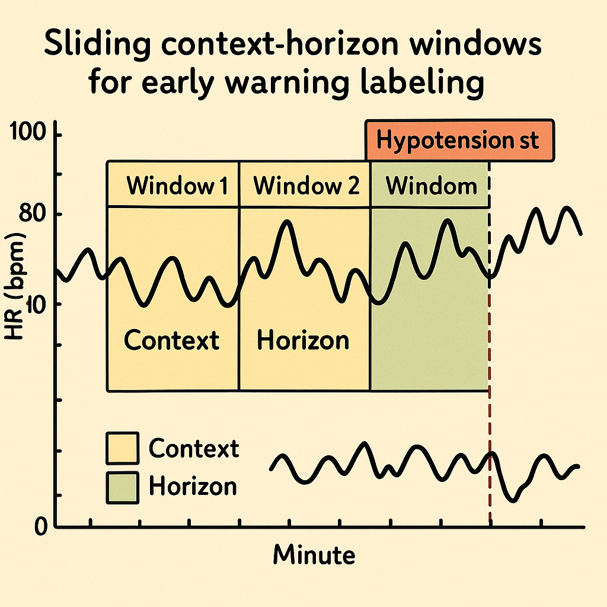
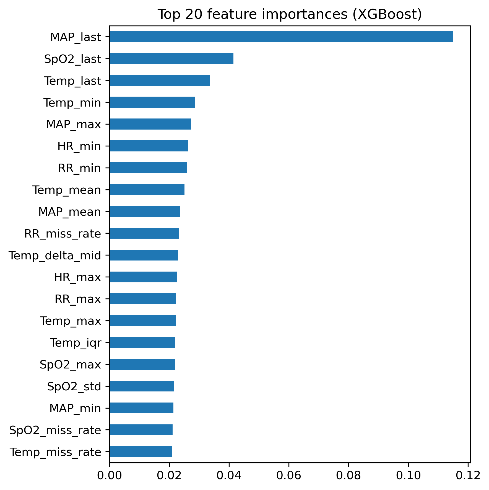
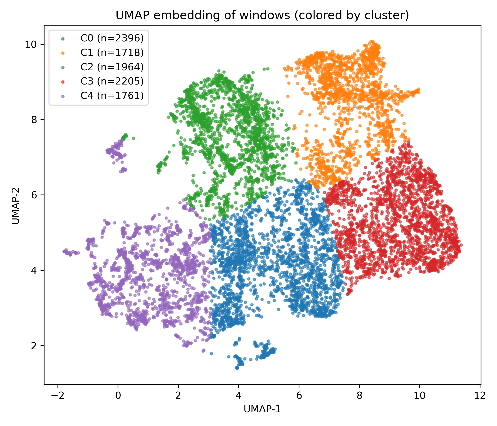
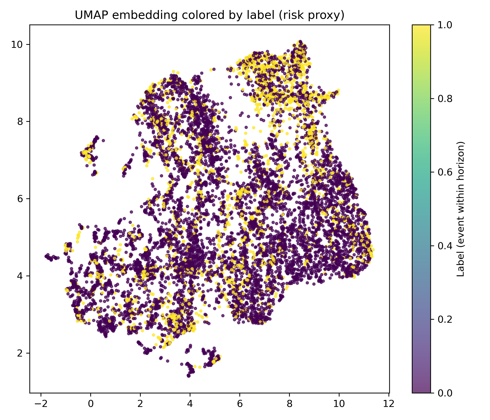

# 🩺 Predictive Modeling for Clinical Outcomes

An interpretable, data-driven framework for **early prediction of hypotension** in patient monitoring data, combining both **supervised** and **unsupervised** machine learning.

---

## 🎯 Project Overview

The goal of this project was to build an **interpretable and data-driven framework** for predicting hypotension events in clinical time-series data using both supervised and unsupervised learning.  
We designed a pipeline that transforms raw minute-by-minute vital signs into **structured 2-hour windows**, extracts physiological and trend-based features, and trains an **XGBoost early-warning model** capable of predicting hypotension up to two hours in advance.

  

---

## 🧠 Model Development and Interpretability

The model achieved meaningful predictive performance and, through its internal learning process, **identified physiologically relevant features—such as the latest mean arterial pressure (MAP), oxygen saturation (SpO₂), and temperature—as the most influential predictors**, showing that it **quantitatively learned which variables mattered most** for risk estimation.

  

---

## 🔍 Pattern Discovery via Unsupervised Learning

Beyond prediction, **unsupervised UMAP and KMeans analyses revealed distinct clusters of patient states**, where high-risk windows naturally grouped together, indicating that the learned feature space captures **latent physiological patterns associated with deterioration**.  
Overall, the project demonstrates a **complete and explainable pipeline for clinical outcome prediction**, combining temporal modeling, feature interpretability, and pattern discovery.

  

  

---
## ⚙️ Methods Summary

- **Data Windowing:** 2-hour rolling windows (context) with 1-hour prediction horizon  
- **Feature Extraction:** Statistical, trend, and variability features per vital sign  
- **Model:** Gradient-boosted decision trees (XGBoost)  
- **Evaluation:** AUROC, AUPRC, and lead-time analysis  
- **Unsupervised Analysis:** UMAP + KMeans for state discovery  

---

## 🧩 Key Achievements

- Developed a **realistic early-warning model** for hypotension detection  
- Demonstrated **interpretability** through feature-importance analysis  
- Discovered **latent patient-state clusters** via unsupervised learning  
- Created **visual, clinically meaningful insights** from raw time-series data  

---

## 🧬 Future Extensions

- Integrate deep learning models (LSTM / Transformer) for end-to-end temporal modeling  
- Extend to multi-center datasets for generalizability  
- Incorporate additional physiological and laboratory data  
